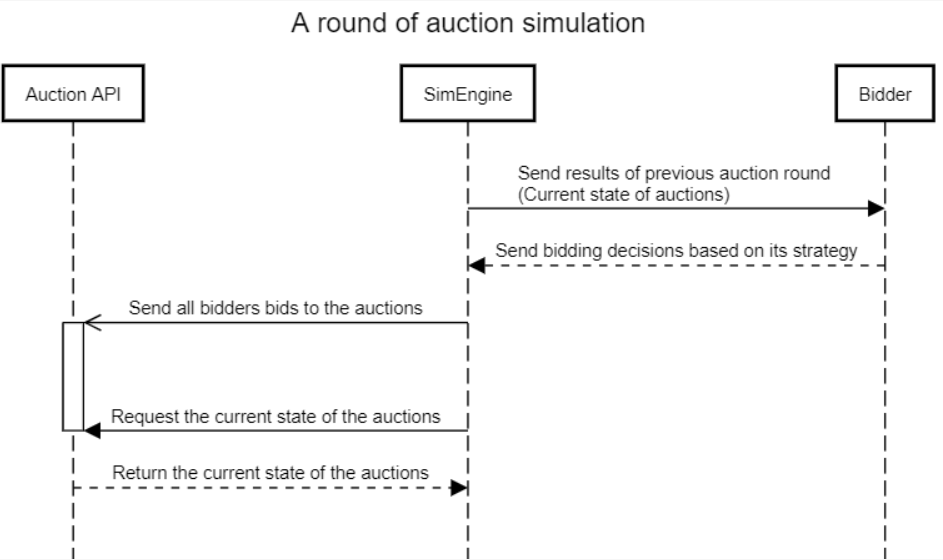

# Simulation environment for demand-supply matching

This project aims to provide a simulation environment and matchmaking for demand-supply matching.

## How to run:

The simulator is dependant on a fork of the Negotiation Engine API: https://github.com/elliotpk/NegotiationEngine to run the simulations, you will also need to setup a mongoDB database. For this system we use "API PILOT 1" from the API, make sure to set your database in db.py, "client = MongoClient....".

Download the simulation environment and install the required libraries (requirements.txt), if your API is not running on localhost port 5000 you may need to change that in APILink.py. 

Setup the config for the simulation you would like to perform (or leave blank for random generation), detailed instructions for how to construct the config.txt can be found in the accompaning "config-instructions.txt". Be warned that setting a high amount of sellers/bidders (especially with random chainlength) will cause the reference calculation to take quite a while.

After this is done you can start the program by running "main.py", it will first generate all the input data such as blocks, sellers and buyers. This will get computed by the reference calculation to get a fairness value and market price for the optimal match between blocks and buyers.

After this is done the simulator will start and the program will terminate after it has completed it's run. 

After a finished run several csv files will be saved in the file path of the project, which run the files belong to can be identified by the digit in the file name.

* test*.csv - Finished auction result, fairness value and buyer final status.
* testE*.csv - All the bids which were submitted by the buyers throughout the simulation, id stands for in which batch of bids they were sent.
* testJbidder*.csv - The configuration of the buyers which were used
* testJseller*.csv - The configuration of the sellers and blocks they have
* refcalcOutdata.csv (optional) - Details related to the reference calculation (needs to be manually enabled in ReferenceCalculator.py line 24)

## Sequence Diagram

This diagram shows the rough process of the simulation.

## Class Diagram

## Behaviour library

There are 3 types of behaviours:

1. A: This is the most aggressive behaviour that will try to bid aggressively with higher bids and bid early.
2. B: This behaviour is a mixture of behaviour A and C that is medium aggressive.
3. C: This is the most passive behaviour and will most likely bid late with lower bids.

### Dictionary keys

Every behaviour has the dictionary keys:

1. "behaviour": This is what type of behaviour it is.
2. "agressiveness": A number between 0 and 1 that tells how aggressive the bidder is. It affects the bid amount and desperation.
3. "adaptiveAggressiveness": Updates the aggressiveness depending on the current round and the max round.
4. "desperation": It is a number between 0 and 1 and tells how likely it is for a bidder to bid depending on the aggressiveness, current round and the max round. 
5. "bidOverMarketPrice": This tells if the bidder can bid over the market price or not.
6. "marketPriceFactor": This affects the bid amount based on normal distribution with a mean and standard deviation value and the aggressiveness.
7. "marketPriceFactorUpdate": This updates the marketPriceFactor value depending on the aggressiveness, mean and standard deviation value.
8. "stopBid": This is the amount of bid that the bidder can't bid over and it's also the maximum bid on an auction. It's in price/unit.
